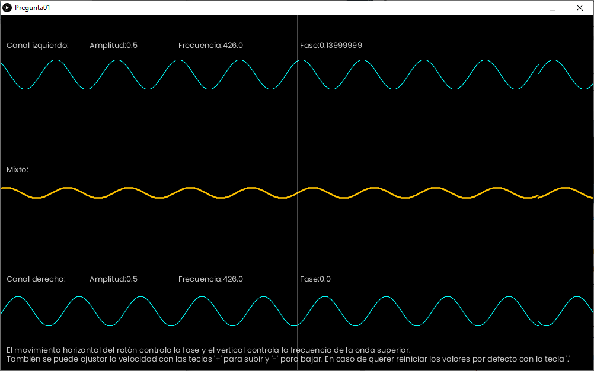
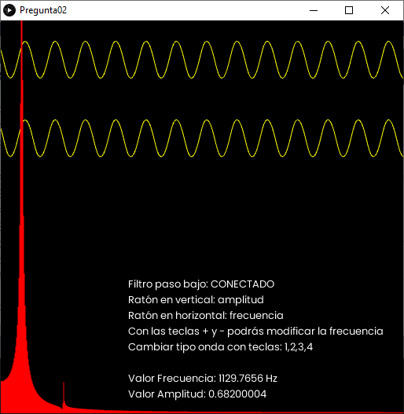
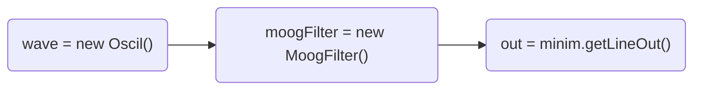
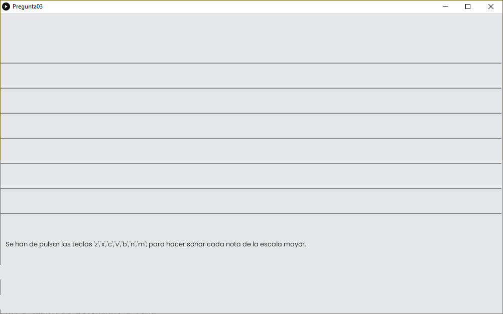

# TPA-Practica02
El objetivo de esta práctica es desarrollar los conceptos teóricos a través de la realización, diseño e implementación de aplicaciones de audio a través del uso de la librería Minim.

## Enunciado pregunta 01



En esta pregunta desarrollaremos una aplicación que permita experimentar con las interferencias entre ondas. Tal y como se ha explicado en el módulo 1, pueden existir interferencias entre ondas de la misma frecuencia (constructiva o destructiva) o de frecuencias ligeramente distintas (batidos de primer orden). Se propone implementar una aplicación que combine las dos familias de interferencias para una mejor comprensión del concepto. Para ello, se proponen los siguientes pasos:

 1. Generar dos ondas senoidales, de amplitud A=0.5 y frecuencia f=440Hz. Una de ellas será fija durante todo el ejercicio y
    la otra podrá cambiar de fase y frecuencia. 
2. Enviar cada una de ellas (objeto Patch) al canal de la izquierda y derecha mediante el objeto Pan.
3.	Enviar la salida de cada onda panoramizada (objeto Patch) a la salida de la tarjeta de sonido (Out). 
4. La onda de la derecha y la izquierda se deben dibujar en la ventana de la aplicación, en la mitad superior e inferior respectivamente (y es lo que se envía a la tarjeta de audio).
5. La suma de las dos ondas se debe dibujar justo en la mitad de la ventana de la aplicación, entre las dos ondas anteriores, con un color que resalte en relación a las anteriores.
6. Se deben dibujar las líneas divisorias horizontal y vertical (ejes) que se cruzan en el centro de la ventana de la aplicación.  
7. El movimiento horizontal del mouse controla la fase entre -0.5 (izquierda) y +0.5 (derecha) con el objeto setPhase.
8. El movimiento vertical del mouse controla la diferencia de frecuencias entre +10Hz (arriba) y -10Hz (abajo) con el objeto setFrequency.
9. La ventana de la aplicación debe mostrar la amplitud, frecuencia y fase de las dos señales originales.
10. La ventana de la aplicación debe indicar al usuario vuestro nombre y el funcionamiento del programa (qué hace el mouse, etc.)

## Enunciado pregunta 02


 En esta pregunta desarrollaremos una aplicación que permita ver y escuchar la d iferencia entre cuatro  tipos de onda: senoidal, triangular, diente de sierra y cuadrada. El análisis espectral mostrará, para cada tipo de onda, la distribución de la frecuencia fundamental y armónicos. Finalmente aplicaremos un filtro paso-bajos donde se podrá comprobar cómo afecta éste a la forma de las ondas y su espectro. 

Para implementar la solución daremos cumplimiento a los siguientes puntos en una ventana de la aplicación de 512x500 píxeles y Processing 3D:

 1. Generar una onda sinusoidal de frecuencia 1200hz y amplitud 0.5 que luego podrá ser  modificada en forma, frecuencia y amplitud.
 2. Enviar el sonido generado (objeto Patch) a la salida de la tarjeta de sonido.
3. Dibujar la forma de onda mostrando el canal izquierdo arriba y el canal derecho justo debajo dejando la mitad inferior de la ventana por el espectro y el texto.
4. El movimiento horizontal del ratón debe controlar la frecuencia variando entre 110 y 2400Hz
5. El movimiento vertical del ratón debe controlar la amplitud que variará entre 0 y 1.
6. Mostrar, en el lugar más adecuado para su lectura, el valor de frecuencia y amplitud aunque el ratón no se encuentre dentro de la ventana, sugerimos derecha inferior.
7. Permitir el cambio de tipo de onda y frecuencia con las siguientes teclas: 
		a. Tecla '1': onda Sinusoïdal
		b. Tecla '2': onda Triangular
		c. Tecla '3': onda Diente de sierra
		d. Tecla '4': onda Cuadrada
		e. Tecla '+': + 1 Hz f. Tecla '-': - 1 Hz
8. A través del objeto FFT con valor de tiempo 1024 y frecuencia 44100, realizar un análisis espectral que debe mostrarse en rojo.
9. Aplicar un filtro pasa bajos con una frecuencia de corte a 1200Hz y resonancia de 0.5
10. Permitir que la tecla 'de el desactive y activarla en la salida.

**Se conectan las diferentes UGens, como osciladores, filtros, etc. para generar el sonido:**
http://code.compartmental.net/minim/

```java
//Cadena de conexión con oscilador-filtro-salida
wave.patch(moogFilter).patch(out);
```

**Para conectar y desconectar el filtro paso bajo (Moog)**
```java
//Se desconecta el filtro
wave.unpatch(moogFilter);
wave.patch(out);

//Se conecta el filtro nuevamente
wave.unpatch(out);
wave.patch(moogFilter);
```

## Enunciado pregunta 03

En esta pregunta implementaremos un pequeño sampler que se tocará con el teclado del ordenador. Los sonidos del sampler se generan cantando (y con vuestra propia voz) una escala mayor ascendente con sonidos cortos, tipo “pap, pep, pip…”, con las 8 notas de la escala. Cada sonido de estos  (correspondiente a cada nota) será activado con una tecla, por ejemplo, siguiendo la secuencia: ‘z’,’x’,’c’,’v’,’b’,’n’,’m’,’,’. En concreto, se pide:

 1. Con las herramientas de grabación disponibles, grabar, con la propia voz, un fichero siguiendo una escala mayor. La escala
    de do mayor suena como en los siguientes ejemplos de FreeSound:  *  
	    a. https://freesound.org/people/marianasasousa/sounds/508679/
	    b. https://freesound.org/people/mooncubedesign/sounds/420501/
	    c. https://freesound.org/people/dobroide/sounds/6497/
2. Con las herramientas de edición disponibles, cortar el fichero grabado enpequeños trozos, cada uno correspondiente a una nota de la escala, y exportarlos en formato .wav, 1 canal (mono), y frecuencia de muestreo fm=44100Hz.
3. A partir del ejemplo “TriggerASample” disponible en los ejemplos de Processing (**File -> Examples -> Contributed Libraries -> Minim -> Basics**, generar un sketch nuevo y guardarlo con el nombre “Pregunta 3”.
4. Dentro de la carpeta del sketch (“Pregunta 3”), crear una subcarpeta data y copiar en su interior  *     los ficheros de audio generados en el apartado 2 (p.ej. “C3.wav”, “D3.wav”, etc.).
5. Diseñar el programa para poder disparar (trigger) las distintas notas con la secuencia de teclas ‘z’,’x’,’c’,’v’,’b’,’n’,’m’’.
6. El programa solo debe tener control sobre el disparo de la muestra, pero no para detenerla (de  ahí que deban ser notas cortas).
7. Dibujar las 8 señales de audio en la ventana de la aplicación, una debajo de otra, deforma que al apretar una tecla se muestre la forma de onda del fichero de audio disparado.
8. Incluir en la ventana de la aplicación, de forma discreta, el nombre del estudiante y el logotipo de la UOC.
